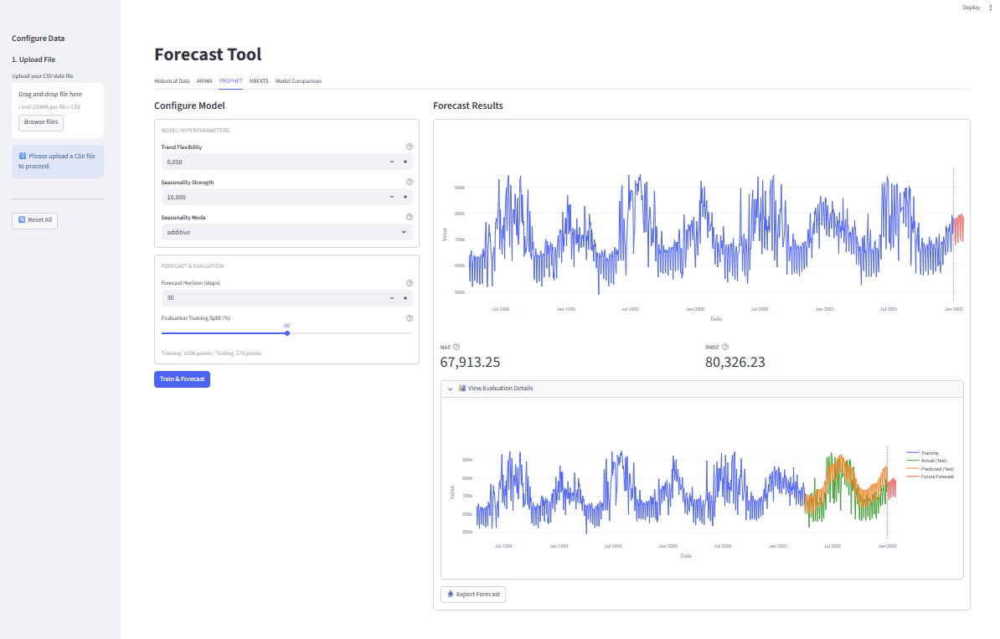

# 📈 Forecast Tool

Interactive app for time series forecasting with data preprocessing, multiple models with hyperparameter settings and model comparison.



## Key Features

🛠️ **Multiple Forecasting Models Implemented**:

- ARIMA _(statistical)_
- Prophet _(business-focused)_
- N-BEATS _(deep learning)_

🧠 **Smart Recommendations**: Models can provide hyperparameter recommendations based on qualities of the time series.

🧹 **Data Preprocessing**: Automatic gap detection, filling and outlier removal.

🏆 **Model Comparison**: Side-by-side evaluation with MAE and RMSE metrics.

🧩 **Easy Code Extension**: Responsive UI for easy new model or metric implementation.

✨ **Interactive UI**: Clean interface with interactive visualizations.


## Quick Start

```bash
# Clone and setup
git clone https://github.com/yourusername/forecast.git
cd forecast

# Create virtual environment 
python -m venv venv
source venv/bin/activate  # Linux
source venv\Scripts\activate  # Windows

# OR use conda
conda create -n forecast python=3.12
conda activate forecast

# Install and run
pip install -r requirements.txt
streamlit run app.py
```


## Usage flow ➡️

1. Upload CSV with date and value columns
2. Select columns and apply preprocessing
3. Choose a model tab
4. Configure hyperparameters (or use recommendations)
5. Specify forecast horizon and evaluation train-test split
6. Train model
7. Compare trained models in the comparison tab


#### Expected Data Upload Format 📤

User can upload CSV containing multiple columns, but must include and select:
- One **datetime column** (any standard format)
- One **numeric value column** to forecast

Additional columns are ignored unless explicitly selected.

Example:
```csv
date,sales,temperature,value
2024-01-01,100,15,234
2024-01-02,105,16,241
2024-01-03,102,14,238
```


## Architecture

```
forecast/
├── app.py                    # Main application
├── models/                   # ARIMA, Prophet, N-BEATS implementations
├── services/                 # Data and model orchestration
├── ui/                       # Streamlit components
├── utils/                    # Evaluation, plotting, validation
└── state/                    # Session management
```


## Tech Stack

- **Streamlit** - UI framework
- **statsmodels** - ARIMA + statistical tests  
- **Prophet** - Forecasting with seasonality
- **Darts** - N-BEATS implementation
- **Plotly** - Interactive visualizations
- **pandas/numpy** - Data manipulation


## Design & Modeling Approach 

For a detailed explanation of strategy concerning app architecture, functionalities, preprocessing, model selection, hyperparameter recommendations, and evaluation see:

📄 [APPROACH.md](docs/APPROACH.md)
